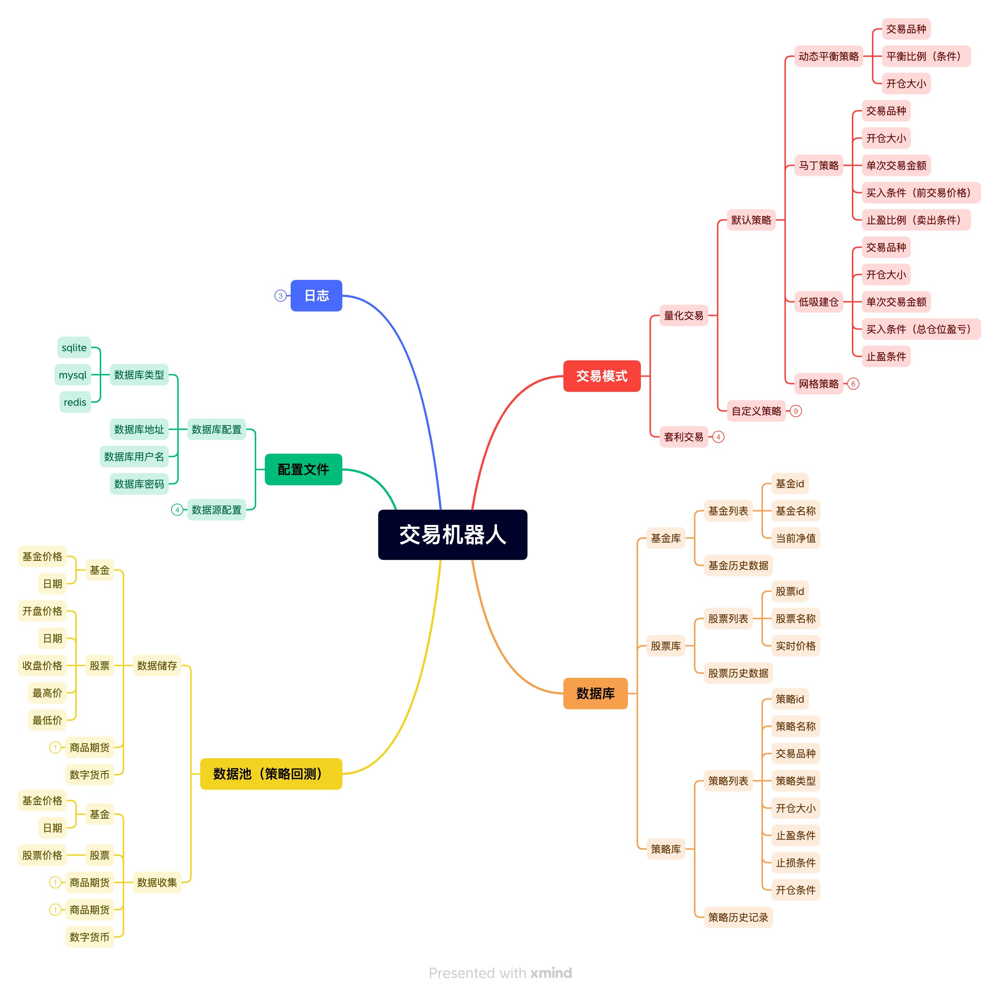

# 交易机器人

## 功能介绍

一个可以根据配置策略进行对股票基金进行操作的交易机器人，目前只支持东方财富证券交易所。

## 策略说明

### 低吸建仓策略

适合在**底部震荡趋势**中开启该策略，建仓开始后，如果当前持仓为亏损状态，并且当天价格为下跌时进行买入，其他情况持仓不动，保证成本价不断减小。

### 马丁格尔策略

适合在**下行趋势**中开启该策略，开启该策略后，每次的买入触发价格都比上一次的买入价格低固定的百分点，下行趋势中不断补仓拉低成本，同时会控制买入频率，防止过度交易深度套牢。

### 动态平衡策略

适合建仓结束后的所有行情，前提要求有闲置资金，将资产和闲置资金配置一个固定的比率，当资产价格上涨时，卖出资产使资产价值与闲置现金维持原有比率，当资产下跌时使用现金购买资产，同样维持原有比率，达到高抛低吸的效果。

### 国债搬砖策略

只适用于国债逆回购单一品种，当国债逆回购收益率大于当天货币基金收益率并且资金占用时间小于30天时买入。

## 使用方法介绍

1. 安装python3环境依赖包：

`pip3 install rsa pyyaml`

2. 进入实盘策略

`python3 src/main.py eastcta`

3. 进入回测策略

`python3 src/main.py virtualcta`

## 详细设计

[详细设计](./doc/详细设计.md)
